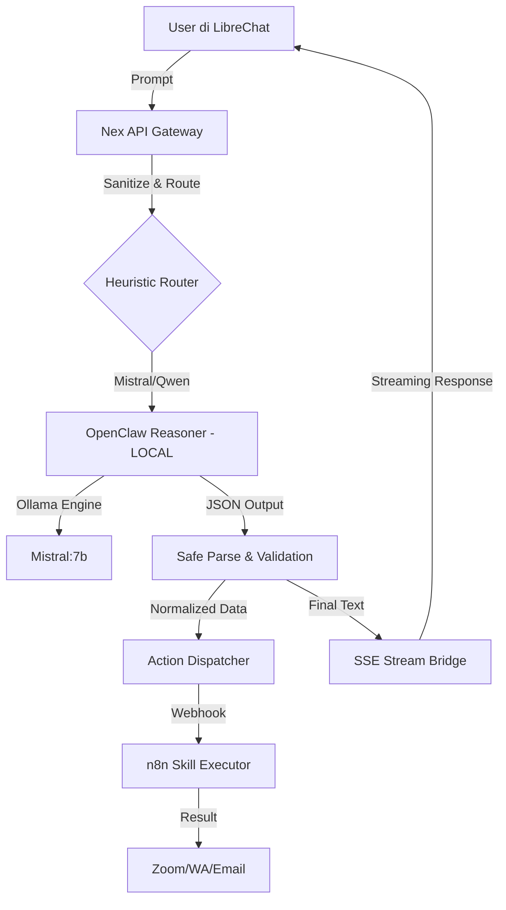

# Nex Agent Skill Hub 🚀

Nex Agent adalah sistem orkestrasi AI deterministik yang menghubungkan **LibreChat** (Frontend) dengan **OpenClaw** (Reasoning) dan **n8n** (Action Execution). 

Sistem ini dirancang khusus untuk mengubah AI dari sekadar mitra percakapan menjadi asisten eksekusi aksi yang handal dengan privasi total.

## ✨ Fitur Utama

- 🧠 **Universal Local Brain**: Berjalan 100% lokal menggunakan **Ollama (Mistral:7b)** melalui backend OpenClaw yang telah dioptimasi.
- 🐚 **Heuristic Model Routing**: Secara otomatis memilih model terbaik (Mistral, Qwen Coder, Phi-3) berdasarkan deteksi niat kunci (*intent*).
- 🛠️ **Unified Skill Hub**: Integrasi langsung dengan n8n untuk eksekusi aksi nyata seperti pembuatan Zoom Meeting, pengiriman WhatsApp, dan Email.
- 🛡️ **Enterprise Guardrail**: Lapisan pertahanan tiga lapis (Sanitize -> Parse -> Validate) untuk menjamin stabilitas sistem dari halusinasi LLM.
- 🧩 **Data Normalization Layer**: Fitur penyembuhan data otomatis (*Data Healing*) yang menstandarisasi format waktu dan durasi.
- 🌊 **SSE Stream Bridge**: Sinkronisasi aliran data real-time dengan standar OpenAI (Streaming) untuk pengalaman chat yang mulus.

## 🔄 Alur Sistem (Flow)



## 🚀 Instalasi & Run

1. Pastikan Docker & Docker Compose terinstal.
2. Jalankan perintah:
   ```bash
   docker compose up -d
   ```
3. Akses LibreChat di `http://localhost:3210`.

---
*Dikembangkan dengan ❤️ untuk ekosistem Agentic Workflow.*
